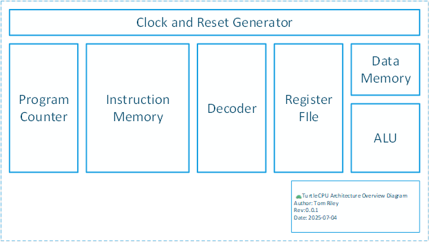
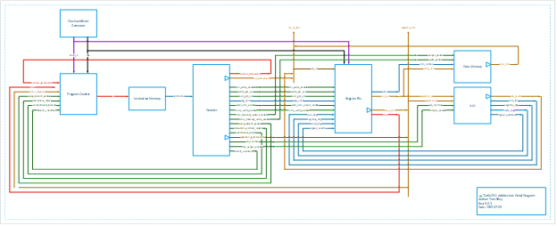

# Turtle CPU Microarchitecture

- [Turtle CPU Microarchitecture](#turtle-cpu-microarchitecture)
  - [References](#references)
  - [1. Overview](#1-overview)
  - [2. Clock and Reset Generator Module](#2-clock-and-reset-generator-module)
    - [Input/Output Ports](#inputoutput-ports)
  - [3. Arithmetic Logic Unit (ALU) Module](#3-arithmetic-logic-unit-alu-module)
    - [Input/Output Ports](#inputoutput-ports-1)
  - [4. Instruction Decoder Module](#4-instruction-decoder-module)
    - [Input/Output Ports](#inputoutput-ports-2)
  - [5. Program Counter Module](#5-program-counter-module)
    - [Input/Output Ports](#inputoutput-ports-3)
  - [6. Register File Module](#6-register-file-module)
    - [Input/Output Ports](#inputoutput-ports-4)
  - [7. Instruction Memory Module](#7-instruction-memory-module)
    - [Input/Output Ports](#inputoutput-ports-5)
  - [8. Data Memory Module](#8-data-memory-module)
    - [Input/Output Ports](#inputoutput-ports-6)

## References

| Tag | Document                | Reference                                                                                                     |
| --- | ----------------------- | ------------------------------------------------------------------------------------------------------------- |
| [1] | Turtle CPU Architecture | [OneDrive Link](https://1drv.ms/w/c/b71dafbf7b819c6e/EW6cgXu_rx0ggLckDxIAAAABYvVQmUBujoLj7bZLZWYyQw?e=062Iyd) |

## 1. Overview

The Turtle CPU is an 8-bit Microcomputer CPU designed to be made from discrete 74-series TTL logic chips. The name “Turtle” comes for “TTL” and from the design philosophy of being reliable—and slow. The design is an implementation of the Turtle CPU Architecture [1]. The following figures show a high-level overview of the blocks in the design, as well as the detailed module connections.

## 2. Clock and Reset Generator Module

Module Name: `clk_rst_gen`

### Input/Output Ports

**Table 1: Clock and Reset Generator Module Ports**

| Port Name     | Direction | Width | Description                                                           |
| ------------- | --------- | ----- | --------------------------------------------------------------------- |
| reset_btn     | Input     | 1     | Reset button input (active high), simulating an external reset button |
| manual_clk_sw | Input     | 1     | Manual clock switch to select between automatic and manual clock      |
| pulse_clk_btn | Input     | 1     | Manual clock pulse button, simulating an external clock step button   |
| clk           | Output    | 1     | System clock output, free running based on parameter value            |
| reset_n       | Output    | 1     | Active-low reset signal                                               |

## 3. Arithmetic Logic Unit (ALU) Module

Module Name: `alu`

### Input/Output Ports

**Table 2: Arithmetic Logic Unit (ALU) Module Ports**

| Port Name       | Direction | Width  | Description                                                                                                         |
| --------------- | --------- | ------ | ------------------------------------------------------------------------------------------------------------------- |
| operand_a       | Input     | DATA_W | First operand input                                                                                                 |
| operand_b       | Input     | DATA_W | Second operand input                                                                                                |
| alu_func        | Input     | 3      | ALU function selector (ADD, SUB, AND, OR, XOR, INV) (Encoding defined in [1])                                       |
| output_enable   | Input     | 1      | Enable signal for ALU result output tri-state. When low, alu_result is Hi-Z to allow the bus to be driven elsewhere |
| alu_result      | Output    | DATA_W | Tri-state ALU result output                                                                                         |
| zero_flag       | Output    | 1      | Zero flag (result == 0)                                                                                             |
| negative_flag   | Output    | 1      | Negative flag (MSB of result)                                                                                       |
| carry_flag      | Output    | 1      | Carry flag (for ADD/SUB operations)                                                                                 |
| signed_overflow | Output    | 1      | Signed overflow flag (for ADD/SUB operations)                                                                       |

## 4. Instruction Decoder Module

Module Name: `decoder`

### Input/Output Ports

**Table 3: Instruction Decoder Module Ports**

| Port Name                 | Direction | Width    | Description                                           |
| ------------------------- | --------- | -------- | ----------------------------------------------------- |
| instruction               | Input     | INST_W   | 16-bit instruction word                               |
| address_immediate         | Output    | I_ADDR_W | Immediate address for branch/jump instructions        |
| acc_immediate             | Output    | DATA_W   | Tri-state immediate value for accumulator             |
| alu_operand_b_immediate   | Output    | DATA_W   | Tri-state immediate value for ALU operand B           |
| acc_write_enable          | Output    | 1        | Enable signal for accumulator write                   |
| write_put_acc             | Output    | 1        | Enable signal for PUT operation (ACC → register)      |
| read_get_acc              | Output    | 1        | Enable signal for GET operation (register → ACC)      |
| reg_addr                  | Output    | 4        | Register address for register file access             |
| read_data_output_enable   | Output    | 1        | Tri-state enable signal for register read data output |
| status_write_enable       | Output    | 1        | Enable signal for status register write               |
| data_memory_write_enable  | Output    | 1        | Enable signal for data memory write                   |
| data_memory_output_enable | Output    | 1        | Tri-state enable signal for data memory read          |
| jump_branch_select        | Output    | 1        | Enable signal for jump/branch operations              |
| immediate_address_select  | Output    | 1        | Select immediate address for branch                   |
| unconditional_branch      | Output    | 1        | Flag for unconditional branch                         |
| branch_condition          | Output    | 3        | Branch condition selector                             |
| alu_output_enable         | Output    | 1        | Enable signal for ALU output                          |
| alu_function              | Output    | 3        | ALU function selector (Encoding defined in [1])       |

## 5. Program Counter Module

Module Name: `program_counter`

### Input/Output Ports

**Table 4: Program Counter Module Ports**

| Port Name            | Direction | Width    | Description                                |
| -------------------- | --------- | -------- | ------------------------------------------ |
| clk                  | Input     | 1        | System clock                               |
| rst_n                | Input     | 1        | Active-low reset signal                    |
| imar                 | Input     | I_ADDR_W | Instruction Memory Address Register        |
| address_immediate    | Input     | I_ADDR_W | Immediate address for branch instructions  |
| jump_branch_select   | Input     | 1        | Enable signal for jump/branch instructions |
| immediate_select     | Input     | 1        | Select immediate address for branch        |
| unconditional_branch | Input     | 1        | Flag for unconditional branches            |
| status_register      | Input     | DATA_W   | Status register containing flags           |
| branch_condition     | Input     | 3        | Branch condition to evaluate               |
| pc                   | Output    | I_ADDR_W | Program Counter output                     |

## 6. Register File Module

Module Name: `register_file`

### Input/Output Ports

**Table 5: Register File Module Ports**

| Port Name               | Direction | Width    | Description                                           |
| ----------------------- | --------- | -------- | ----------------------------------------------------- |
| clk                     | Input     | 1        | System clock                                          |
| reset_n                 | Input     | 1        | Active-low reset signal                               |
| acc_out                 | Output    | DATA_W   | Accumulator output (always available)                 |
| acc_in                  | Input     | DATA_W   | Accumulator input from tristate bus                   |
| acc_write_enable        | Input     | 1        | Write enable for accumulator                          |
| read_get_to_acc         | Input     | 1        | Enable for internal tristate from read_data to acc_in |
| write_put_acc           | Input     | 1        | Enable for internal write from ACC to reg[reg_addr]   |
| reg_addr                | Input     | 4        | Register address for read/write operations            |
| read_data_output_enable | Input     | 1        | Enable for read data tristate output                  |
| read_data               | Output    | DATA_W   | Tri-state output for read data                        |
| status_write_enable     | Input     | 1        | Enable for status register write                      |
| zero_flag               | Input     | 1        | Zero flag from ALU                                    |
| negative_flag           | Input     | 1        | Negative flag from ALU                                |
| carry_flag              | Input     | 1        | Carry flag from ALU                                   |
| overflow_flag           | Input     | 1        | Overflow flag from ALU                                |
| dmar                    | Output    | D_ADDR_W | Data Memory Address Register                          |
| imar                    | Output    | I_ADDR_W | Instruction Memory Address Register                   |

## 7. Instruction Memory Module

Module Name: `instruction_memory`

### Input/Output Ports

**Table 6: Instruction Memory Module Ports**

| Port Name   | Direction | Width    | Description                         |
| ----------- | --------- | -------- | ----------------------------------- |
| addr        | Input     | I_ADDR_W | Address input for instruction fetch |
| instruction | Output    | INST_W   | 16-bit instruction output           |

## 8. Data Memory Module

Module Name: `data_memory`

### Input/Output Ports

**Table 7: Data Memory Module Ports**

| Port Name     | Direction | Width    | Description                            |
| ------------- | --------- | -------- | -------------------------------------- |
| data_addr     | Input     | D_ADDR_W | Address input for data memory access   |
| write_data    | Input     | DATA_W   | Data input for memory write operations |
| write_enable  | Input     | 1        | Enable signal for memory write         |
| output_enable | Input     | 1        | Enable signal for memory read output   |
| read_data     | Output    | DATA_W   | Tri-state data output for memory read  |

